# Corporate IT Support Lab

## Overview
Simulated a fully functional corporate IT environment for Ruiz Medical Group using Windows Server 2022, Active Directory, Group Policy, osTicket, and PowerShell.

## Tools Used
- VirtualBox
- Windows Server 2022
- Windows 11 Enterprise
- Active Directory Domain Services
- Group Policy Management
- osTicket
- PowerShell

## What Was Built
- Domain controller with 11 users across 4 departments
- Organizational Units and Security Groups
- 3 Group Policy Objects enforcing enterprise security settings
- 15 documented help desk tickets with full resolution notes
- 3 PowerShell automation scripts

## Skills Demonstrated
- Active Directory administration
- Group Policy configuration
- Help desk ticket handling and documentation
- PowerShell scripting and automation
- Windows Server 2022 deployment

## Screenshots

### Virtual Machines
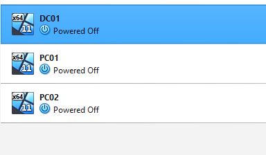

### Windows Server 2022 Loaded
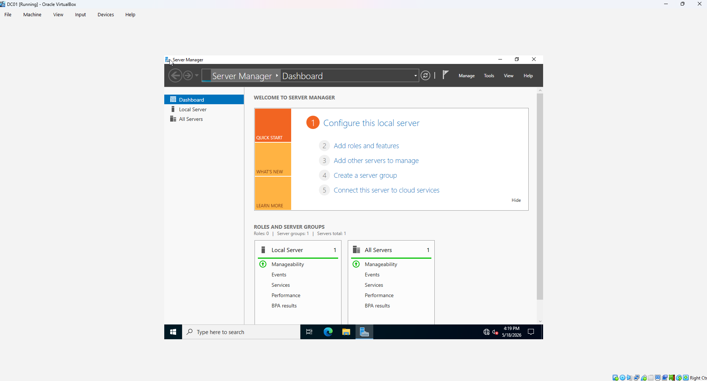

### Active Directory Users
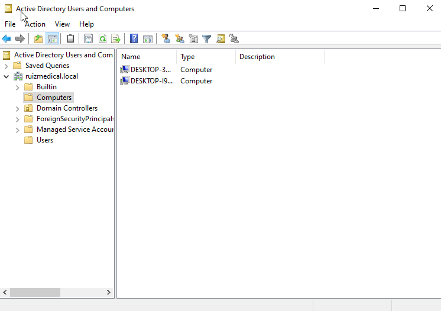

### HR Users
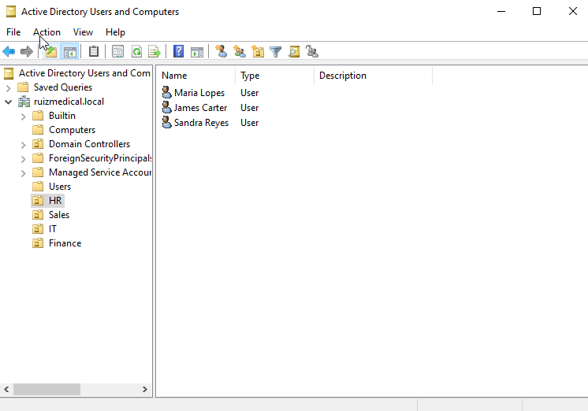

### IT Users
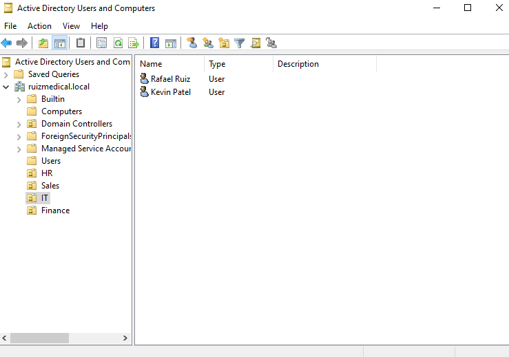

### Sales Users
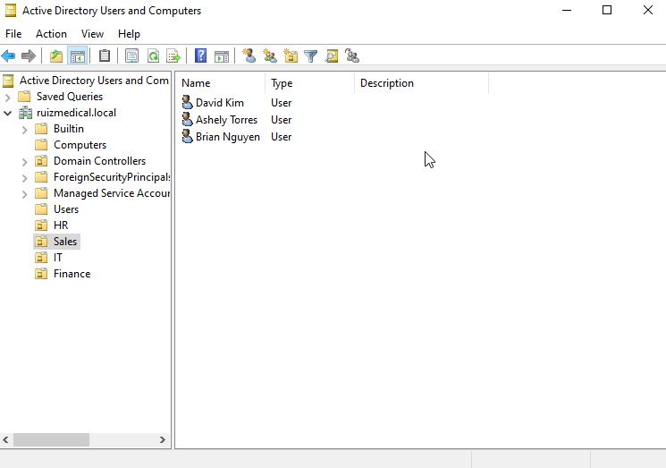

### Finance Users
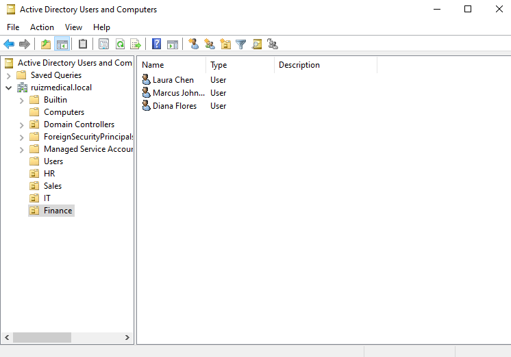

### HR Group Members
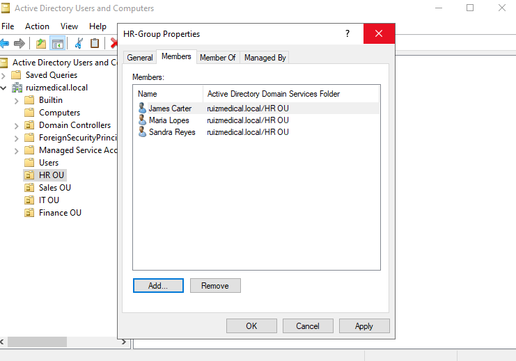

### GPO Wallpaper Policy
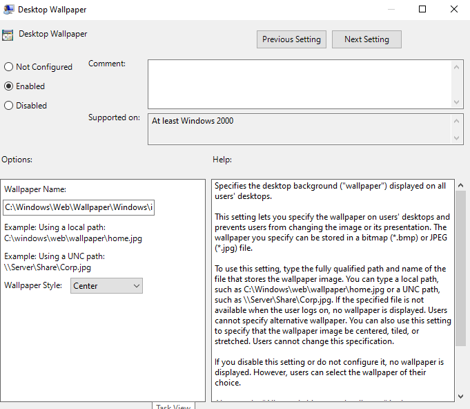

### GPO USB Restriction
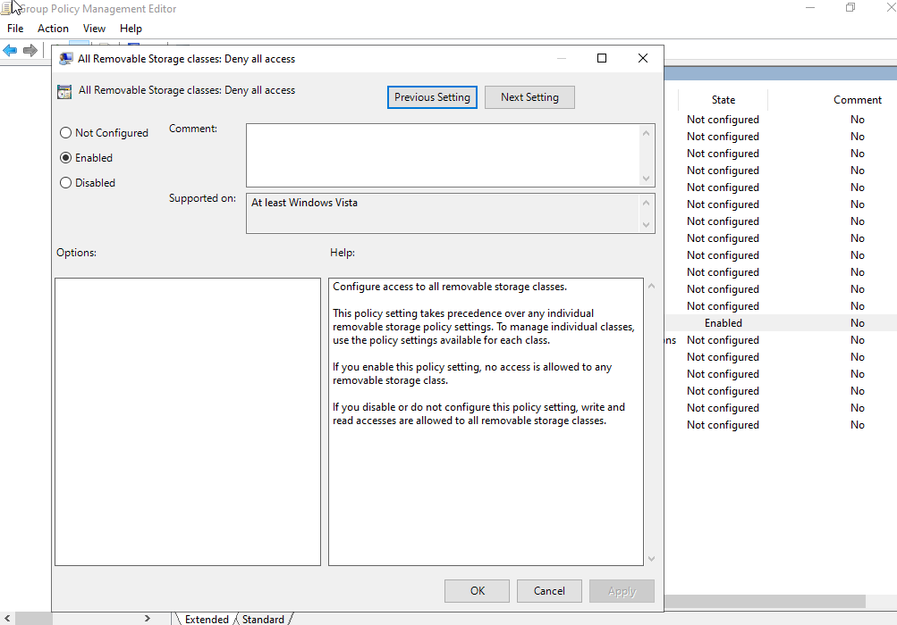

### GPO Control Panel Disabled
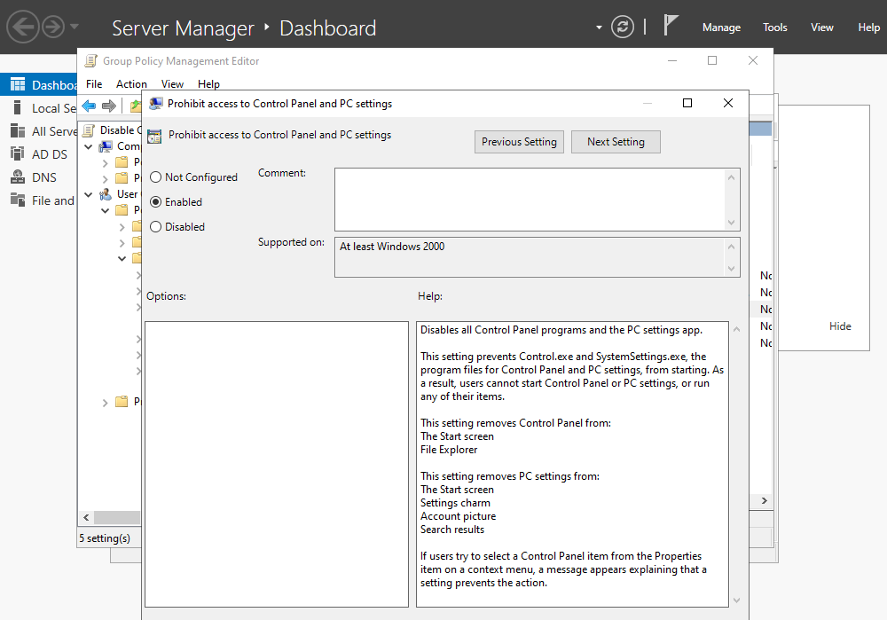

### Control Panel Blocked on PC01
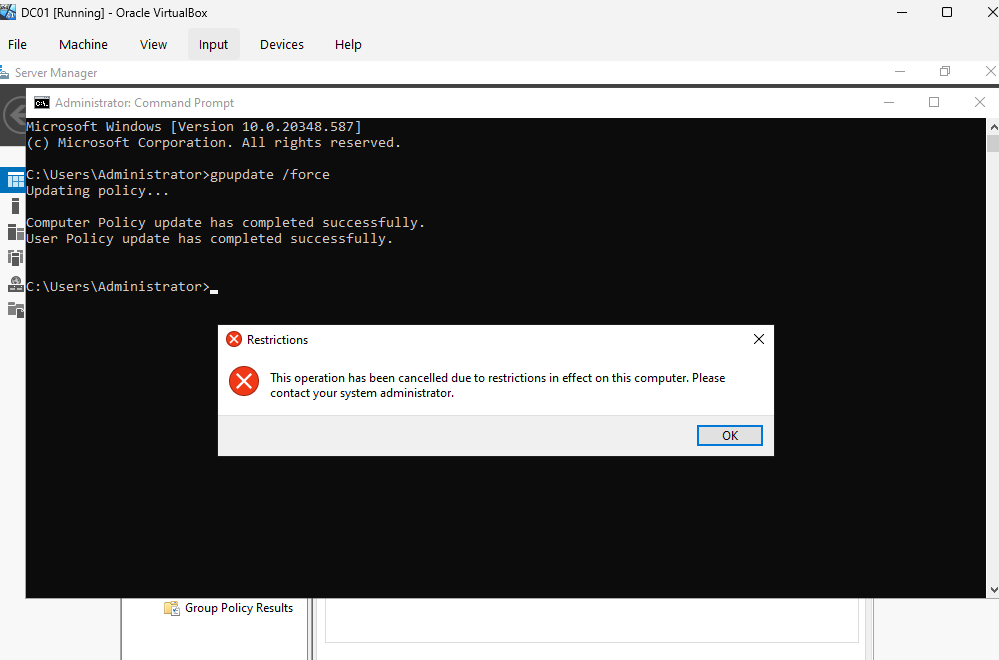

### osTicket Installed
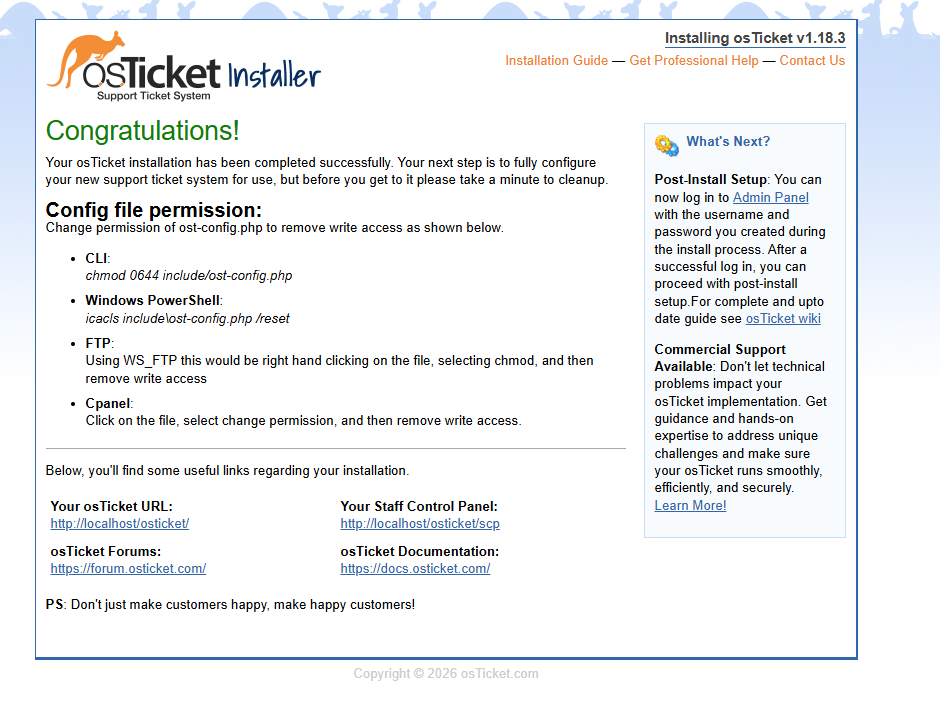

### Open Tickets
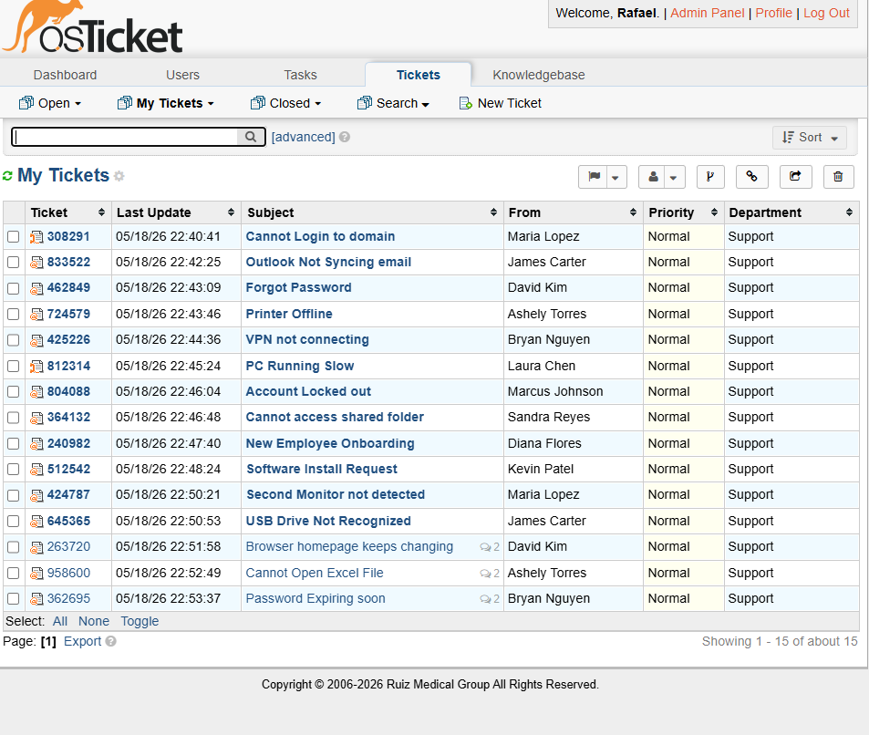

### Resolved Ticket
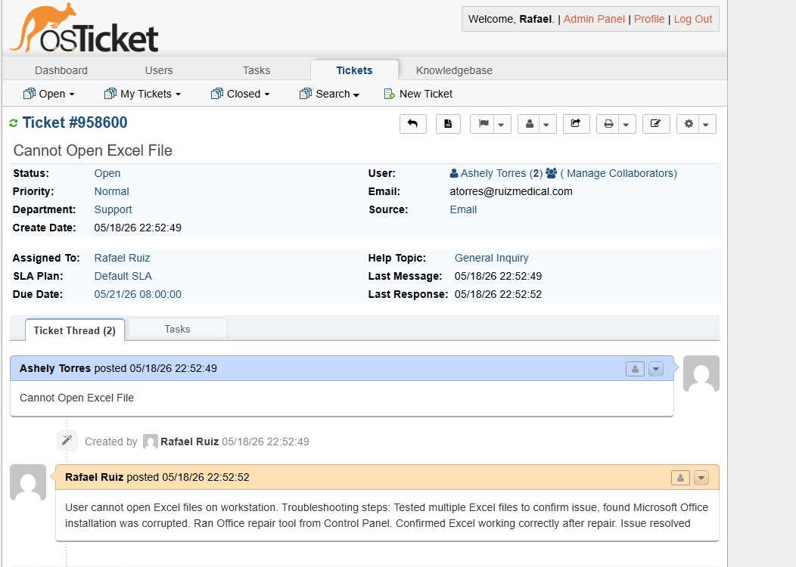

### Bulk User Creation Script

### Unlock Accounts Script

### Inactive Users Report

